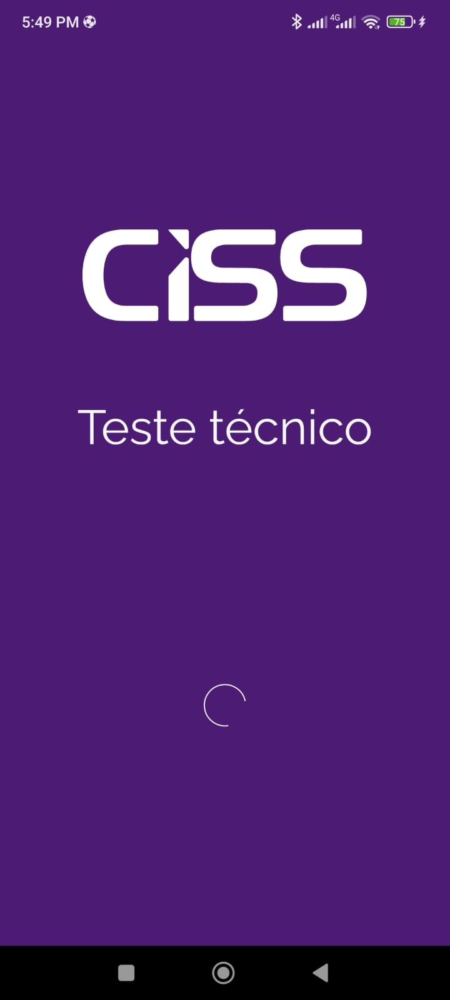
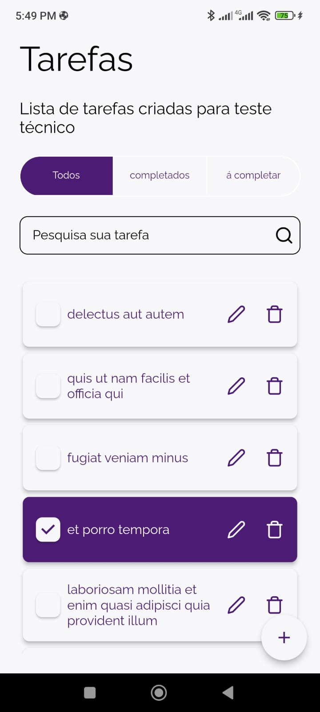
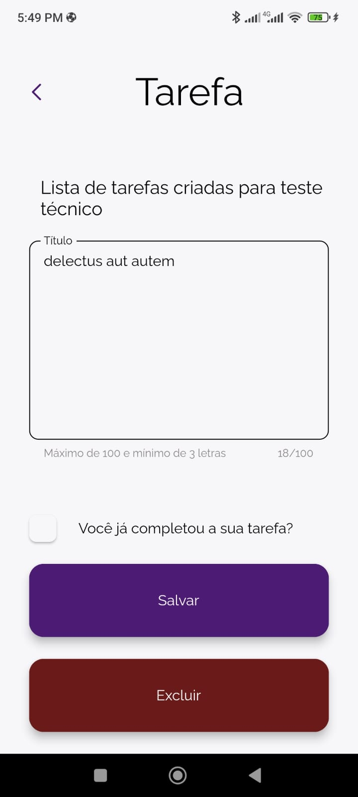
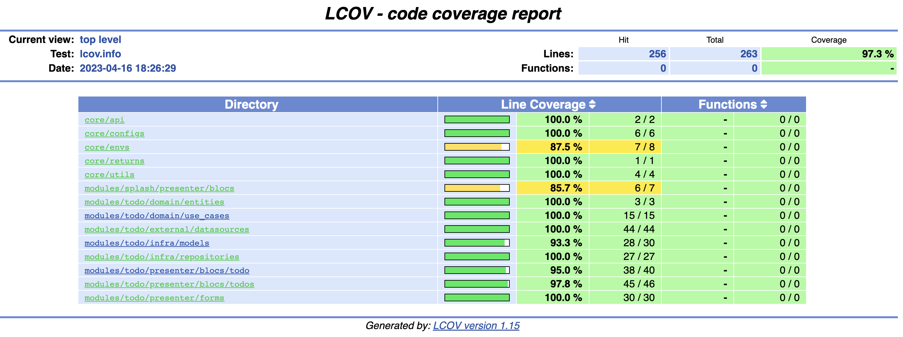

# flutter-ciss-test
Projeto desenvolvido para suprir o teste técnico requisitado para a vaga de Desenvolvedor Flutter na empresa CISS

Splash Page            |  Todos Page             |  Todo Page
:-------------------------:|:-------------------------:|:-------------------------:
  |    |  

# Usage

## Run

Para rodar o projeto localmente é necessário ter o flutter instalado em sua máquina, você pode instalar conforme a documentação oficial do flutter:

[Flutter Install](https://docs.flutter.dev/get-started/install)

Utilizando o vscode podemos utilizar os ambientes criados no nosso arquivo .vscode/launch.json, sendo assim, utilizando a aba de debug, conforme o print abaixo, rodamos o projeto no ambiente de desenvolvimento, podemos escolher também o ambiente de homologação e produção, a escolha do ambiente acarreta na utilização das configurações corretas de ambiente, como o end point utilizado.


## Use Docker

É possivel utilizar um container docker para realizar os fluxos de trabalho, como instalar depêndencias, lint, testes e build.

Primeiramente é indicado instalar o Taskfile (Ferramenta de execução/construção de tarefas), conforme documentação:

[Taskfile Install](https://taskfile.dev/installation/)

Depois para iniciar o docker roda-se o comando:

```sh
task compose:up
```

Ou sem o taskfile

```sh
docker compose up -d
```

## Install Dependencies

Para instalar as dependências do projeto temos 2 métodos, local e utilizando um docker.

### Install Dependencies local

Rode o comando abaixo para instalar as depêndencias localmente:

```sh
flutter pub get
```

ou com Taskfile:

```sh
task install:dependencies:local
```

### Install Dependencies with docker

Rode o comando abaixo para instalar as depêndencias utilizando o docker:

```sh
docker-compose run \
    builder sh -c "\
    git config --global --add safe.directory /home/flutter && \
    rm -rf pubspec.lock && \
    flutter clean && \
    flutter pub get"
```

ou com Taskfile:

```sh
task install:dependencies
```

## Run Lint

Para analisar o código do projeto temos 2 métodos, local e utilizando um docker.

### Run Lint local

Rode o comando abaixo para analisar o código localmente:

```sh
flutter analyze --no-fatal-infos
```

ou com Taskfile:

```sh
task review:lint:local
```

### Run Lint with docker

Rode o comando abaixo para analisar o código utilizando o docker:

```sh
docker-compose run \
    builder sh -c "\
    git config --global --add safe.directory /home/flutter && \
    flutter analyze --no-fatal-infos"
```

ou com Taskfile:

```sh
task review:lint
```

## Run Unit Tests

Para rodar os testes unitários e gerar o arquivo coverage temos 2 métodos, local e utilizando um docker.

Para ver o resultado vc deve abrir o seu arquivo `.reports/coverage/index.html` em um navegador, exemplo do último coverage que rodou no projeto:



### Run Unit Tests local

Rode o comando abaixo para instalar as depêndencias localmente:

```sh
rm -rf .reports && \
    mkdir -p .reports && \
    flutter test --coverage && \
    mv coverage .reports/coverage && \
    genhtml -o .reports/coverage .reports/coverage/lcov.info
```

ou com Taskfile:

```sh
task review:test:local
```

### Run Unit Tests with docker

Rode o comando abaixo para rodar os testes unitários utilizando o docker:

```sh
docker-compose run \
    builder sh -c "\
    git config --global --add safe.directory /home/flutter && \
    rm -rf .reports && \
    mkdir -p .reports && \
    flutter test --coverage && \
    mv coverage .reports/coverage && \
    genhtml -o .reports/coverage .reports/coverage/lcov.info"
```

ou com Taskfile:

```sh
task review:test
```

## Build Android

Para construir o arquivo apk do projeto temos 2 métodos, local e utilizando um docker.

### Build Android local

Rode o comando abaixo para construir o apk localmente:

```sh
flutter build apk --release -t lib/main_dev.dart --dart-define=env=dev
```

ou com Taskfile:

```sh
task build:application:local
```

### Install Dependencies with docker

Rode o comando abaixo para construir o apk utilizando o docker:

```sh
docker-compose run \
    builder sh -c "\
    git config --global --add safe.directory /home/flutter && \
    flutter build apk --release \
        -t lib/main_{{.ENV}}.dart \
        --dart-define=env={{.ENV}} && \
    mkdir -p artifacts && \
    mv build/app/outputs/flutter-apk/app-{{.ENV}}-release.apk artifacts"
```

ou com Taskfile:

```sh
task build:application
```

